# ALU Simulink Design 1 & 4 Bit

## Project Description
The ALU is one of the most critical components in a microprocessor, and it is typically the first part of the processor
to be designed. Following the design of the ALU, the remainder of the microprocessor is implemented to feed operands and
control codes to the ALU.

## ALU Operations
We aim to design an ALU that does eight operations shown below in the table. Follow the same
order.

**Logical Operation:**
- **NAND**: (A B)'
- **NOR**: (A + B)'
- **XOR**: A ⊕ B
- **Equality**: A == B

**Arithmetic Operations:**
- **Add Cin to (A and B)**: Cin + AB
- **Add A, B and Cin**: A + B + Cin 
- **Subtract B from A**: A - B
- **Increment A**: A ++

## ALU 1-Bit
- **Adder:**  Cin to (A and B). 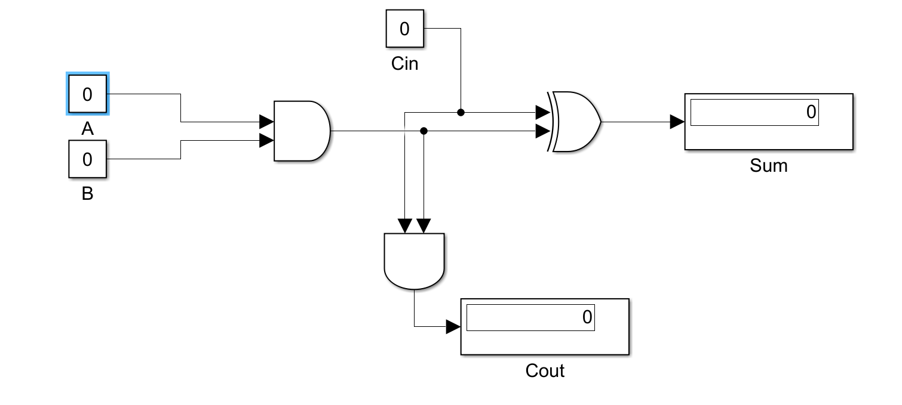
- **Full-Adder:**  Add A, B and Cin. 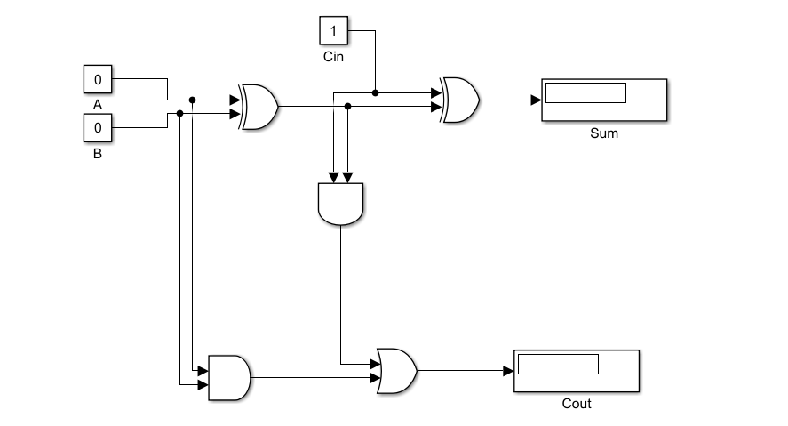
- **Equality:**  A == B. 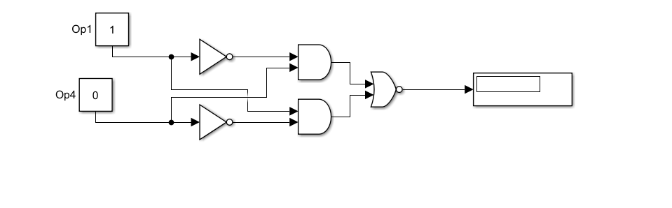
- **Subtractor:**  A - B. 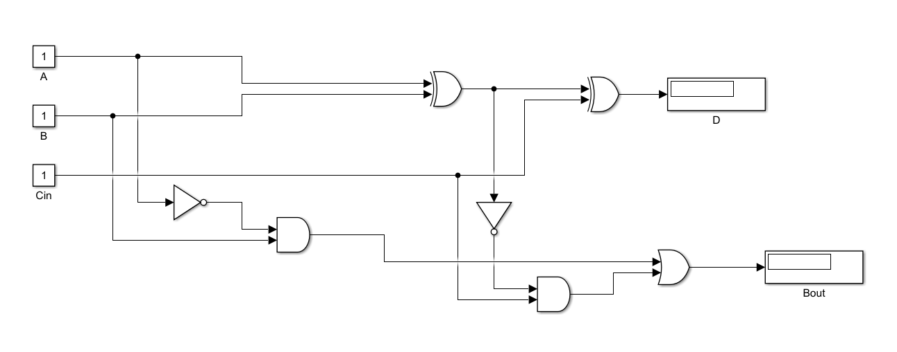
- **Increment:**  A ++. 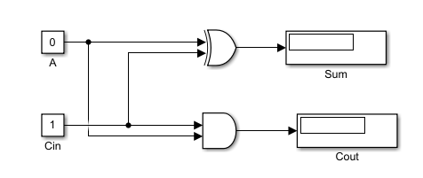
- **ALU:** Full design 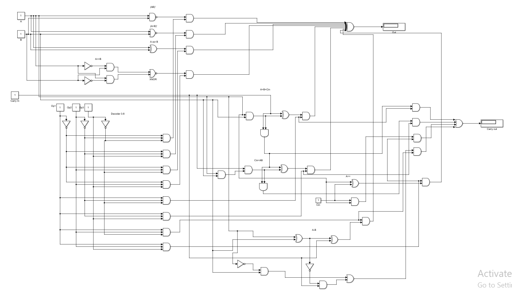

## ALU 4-Bit
- **Adder:**  Cin to (A and B). 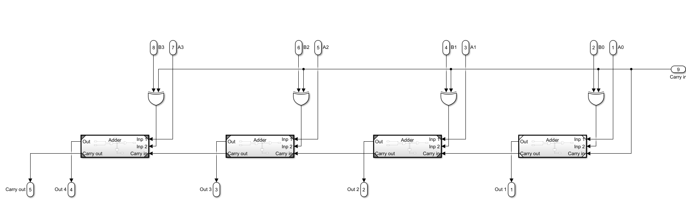
- **Subtractor:**  A - B. 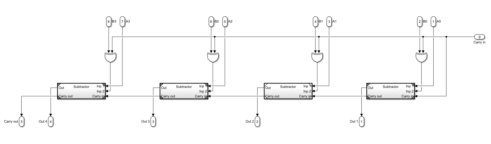
- **Decoder:**  3 to 8 bit Decoder. 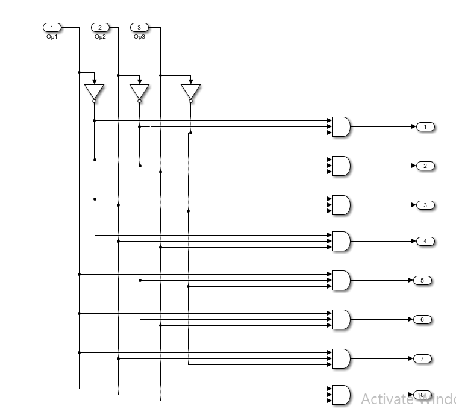
- **Mux:**  8 to 3 bit Multiplexer. 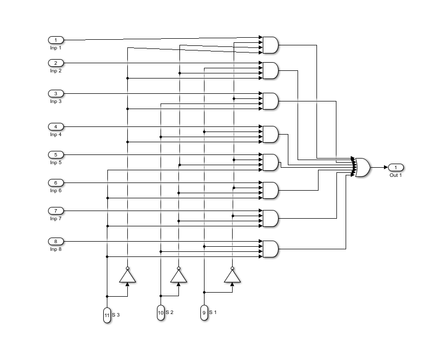
- **ALU:** Full design 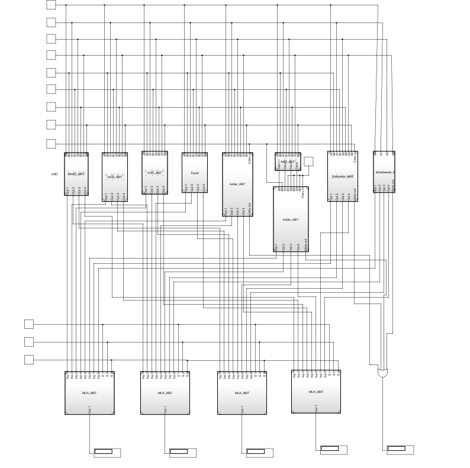
